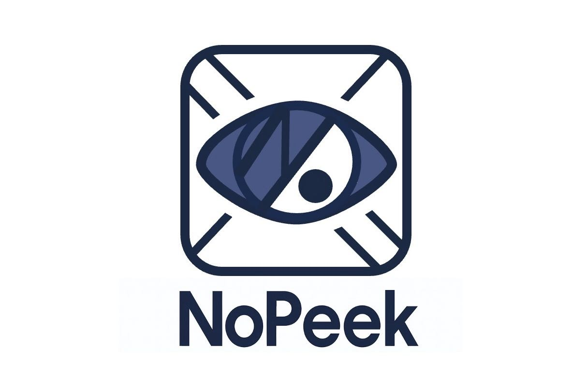
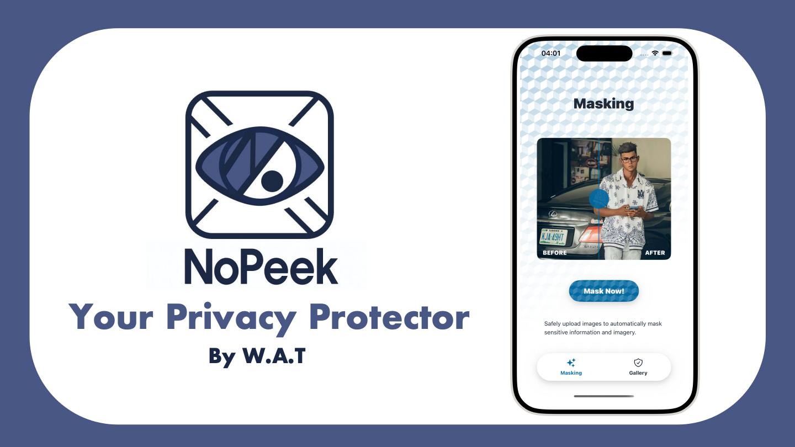

<p align="center">
    
</p>

<h1 align="center">NoPeek: AI-Powered Photo Privacy Protection</h1>

<p align="center">
  <a href="https://youtu.be/meq0yFQ_fOY">
    
  </a>
  <br>
  <em>Click to Watch Youtube Demo Video</em>
</p>


# Content

- [About NoPeek](#about-nopeek)
- [Powered by](#powered-by)
- [Custom Lynx Modules](#custom-lynx-modules)
- [How to Use NoPeek](#how-to-use-nopeek)
- [Documentation](#documentation)
- [License](#license)

# About NoPeek

NoPeek is an iOS application built with the Lynx frontend framework, designed to protect users’ privacy when sharing photos on social media.  
The app leverages AI-powered detection and obfuscation to automatically identify sensitive information—such as faces, license plates and sensitive documents—and applies customizable protection (blur, generative AI, sticker replacement).

- 🔍 **AI Detection**: Automatically detects faces, license plates, and documents objects on photos.
- 🛡 **Multiple Privacy Protection Modes**: Provides blur, sticker substitution, and generative AI-based transformations.
- 📱 **Native iOS Experience**: Built with the Lynx framework for smooth and responsive performance.
- 📤 **Easy Social Media Integration**: Seamlessly connects with social media apps, allowing one-tap posting of privacy-protected photos directly to TikTok.


## Powered by

We carefully designed and selected tools that balance robust AI capabilities with secure infrastructure:

- **Frontend Development – [Lynx](https://lynxjs.org/)**: Used to rapidly prototype and integrate AI-powered privacy features into a smooth, user-friendly interface.
- **Metadata Stripping – piexifjs**: Removes EXIF metadata (location, device, timestamps) before upload.
- **Object Detection – YOLO + InsightFace + Custom CV Pipelines**
  - [YOLOv8 License Plate Recognition](https://github.com/Muhammad-Zeerak-Khan/Automatic-License-Plate-Recognition-using-YOLOv8)
  - [InsightFace](https://github.com/deepinsight/insightface) for facial recognition
  - Custom CV pipelines for detecting sensitive visuals like documents and passports
- **AI Art Transformation – FLUX Diffusion Models + LoRA**
  - [FLUX Diffusion Model](https://huggingface.co/black-forest-labs/FLUX.1-Depth-dev) for stylized avatars
  - [LoRA Collection](https://huggingface.co/XLabs-AI/flux-lora-collection?utm_source=chatgpt.com) for personalization
- **Backend Infrastructure – FastAPI + MySQL**: Fast, lightweight APIs with secure, scalable database management.

# Custom Lynx Modules
Following the [Lynx guide on creating custom native components](https://lynxjs.org/zh/guide/custom-native-component.html#处理前端更新的样式和属性,platform=ios),  we extended Lynx for **NoPeek**, adding iOS-native components that enhance interaction and media handling capabilities.  

- 📱 **Custom UI Components**

    -  **GestureRecognizer**  
  Integrates multiple gesture recognizers (tap, long press, pan, swipe, pinch, and rotation) for iOS.
    - **PhotoPicker**  
  Provides a photo picker view that lets users select images with configurable size and quality options.
    - **PhotoSaver**  
  Saves images to the system photo library and observes library changes.

- ⚙️ **Custom Native Modules**

    - **NativeImageFileManager**  
  Handles image file operations—save, read, list, delete, and get dimensions—within the app’s document directory.  
 
    - **LynxSettingManager**  
  Provides lightweight key–value storage (save, retrieve, clear) backed by `UserDefaults`.  

These modules provide gesture recognition, photo picking, and photo saving features, seamlessly integrated with the Lynx framework.

# How to Use NoPeek

## Requirements

NoPeek is developed for iOS devices and built on macOS environments. Below are the key requirements:

- Target Platform: iOS 15.0+
- Development OS: macOS (Frontend) and Ubuntu 22.04 (Backend)
- Build Tool: Xcode 14+
- Frontend: 
    - Node.js 18.0+
    - pnpm 7.0+
    - Lynx 3.4.0+
    - rspeedy 0.10+
- Backend: 
    - Python 3.12+
    - FastAPI 0.110+
- Database: MySQL 8.0+

## Getting Started

Follow these steps to set up and run NoPeek locally:

1. Clone the Repository

    ```bash
    git clone https://github.com/your-team/PhotoSafer.git
    cd nopeek
    ```

2. Install Dependencies

- Backend (FastAPI + Python)

    ```bash
    cd backend
    pip install -r requirements.txt
    ```

- Frontend (Lynx + Node.js)

    - Refer to the official [Lynx documentation](https://lynxjs.org/guide/start/quick-start.html#ios-simulator-platform=macos-arm64,explorer-platform=ios-simulator) to configure the environment.

    - Then install the project dependencies:

        ```bash
        cd frontend/frontemd_code
        pnpm install
        ```
- Development 

    To use iOS App:
    1. Download the project
    2. Run pod install
    3. Connect your phone to Xcode (either with a cable or via hotspot), and set the target to your own device
    4. Click Run to launch it on your phone

3. Run the Project

- Backend

    ```bash
    cd backend
    python -m uvicorn test:app --reload --host 0.0.0.0 --port 8000
    ```

- Frontend

    ```bash
    cd frontend
    pnpm run dev
    ```

4. Open the App
- Access backend APIs at: http://127.0.0.1:8000/docs
- Access the iOS app in the simulator via Xcode.

# Documentation

For a deeper dive into NoPeek, check out the full 📄 [Project Documentation](./documents/Documentation.pdf).

# License

This project is licensed under the Apache License Version 2.0 License - see the [LICENSE](LICENSE) file for details.